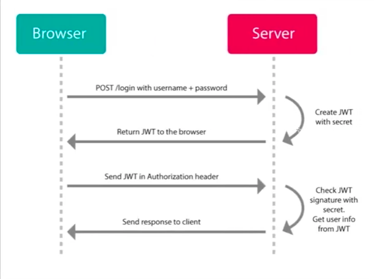

## Terminology
Authentication (tokens)
: The process of verifying who a user is.

Authorization (access tokens, keys)
: The process of verifying what an application has access to.

Comparing these processes to a real-world example, when you go through security in an airport, you show your ID to authenticate your identity. Then, when you arrive at the gate, you present your boarding pass to the flight attendant, so they can authorize you to board your flight and allow access to the plane.

Source: - [Authentication vs. Authorization](https://auth0.com/docs/get-started/authentication-and-authorization) on Auth0

## Common API connection methods
Note: Basic Authentication (when you type your username and password) is not recommended for API connections.

### API Keys
- Is an authorization scheme that does _not_ authenticate the user.
- Identifies the application making the request and can be revoked.
- Keys are considered public and are inherently insecure.
- The general process for creating a key:
    1. Login to the service portal.
    2. Find/generate your API key. This is usually under Settings or similar.
    3. Copy your API key into your application.
    4. Follow the instructions provided by the service to test your API key.

### OAuth2 Tokens
- A modern (and often recommended) authentication standard that identifies the user to a service (i.e GitHub, Twitter, etc).
- Tokens should be kept private and should only be used on the server, never the browser.
- Access tokens can be tied to particular scopes, which restrict the types of operations and data the application can access.
- Like API keys, tokens can be revoked.

### JSON Web Tokens (JWT)
- JWTs can be used for other purposes than API authentication.
- Is a token scheme that can be used in combination with OAuth.
- Advantage: a JWT can store any type of data, thereby reducing the number of database calls.

## Attributions
- [Authentication vs. Authorization](https://auth0.com/docs/get-started/authentication-and-authorization) on Auth0
- [Why and when to use API keys](https://cloud.google.com/endpoints/docs/openapi/when-why-api-key)
- [API Keys vs OAuth Tokens vs JSON Web Tokens](https://zapier.com/engineering/apikey-oauth-jwt/)
- Video: [OAuth Vs JWT - What is the difference?](https://www.youtube.com/watch?v=a9R3Gq1BKxI)